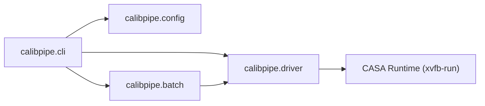

# API Reference

`calibpipe` provides modular Python interfaces for command-line parsing, TOML configuration loading, single-run execution, and Slurm batch management.

## Module Summary

| Module | Description |
| :--- | :--- |
| [`calibpipe.cli`](cli.md) | Unified command-line entry point and subcommand routing for `run`, `batch`, `env`, and `config`. |
| [`calibpipe.config`](config.md) | TOML configuration loader, environment resolution, and path reachability validation. |
| [`calibpipe.driver`](driver.md) | Single-run pipeline orchestrator, log management, and CASA subprocess execution. |
| [`calibpipe.batch`](batch.md) | Slurm batch submission generator, pipefile parser, and submit-host guards. |

---

## Architecture Overview

