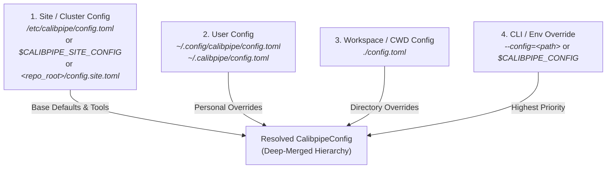
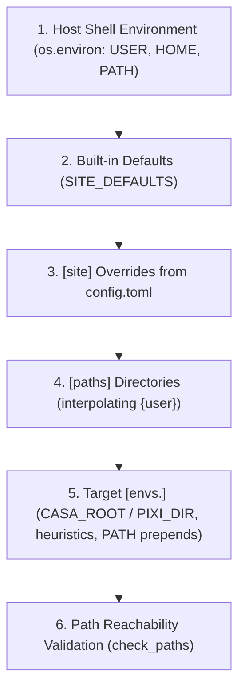
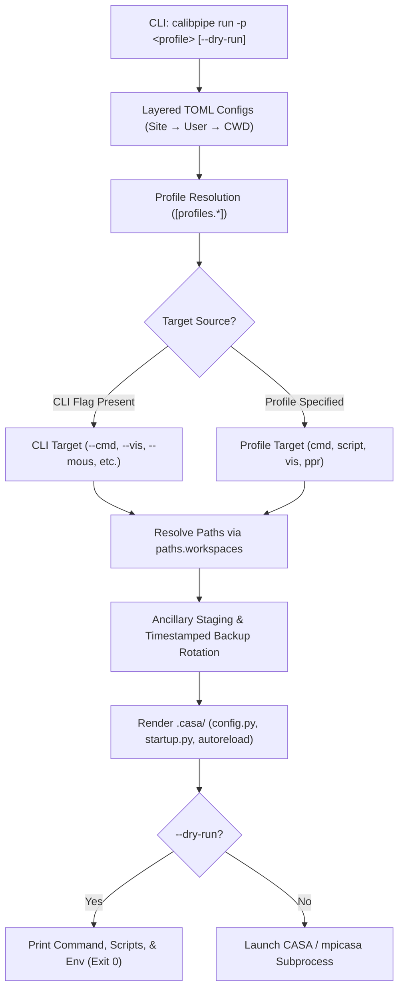
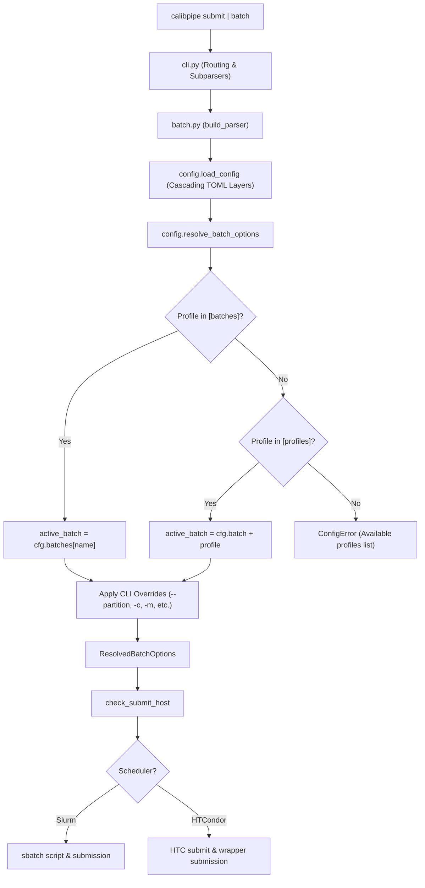

# calibpipe Documentation

`calibpipe` is a lightweight helper package for launching single-run and batch ALMA Science Pipeline jobs outside the main `pipeline` Python package. It is intended for validation, testing, and development workflows where operators and developers need a stable command-line interface, reproducible environment selection, and backward-compatible wrappers around existing `calibPipeIF.py` and `runbatch.py` usage patterns.

---

## Overview

Use `calibpipe` when you need to:

- run a single MOUS from the command line without entering an interactive CASA session
- submit many MOUS runs to Slurm from a pipefile
- resolve CASA and pipeline environment variables from TOML configuration instead of ad hoc shell scripts
- preserve compatibility with existing scripts that still call `calibPipeIF.py`, `runbatch.py`, or `calibpipe_env.sh`

`calibpipe` does not replace the main `pipeline` package. The `pipeline` repository still provides the reduction framework, heuristics, task implementations, and weblog generation. Rather than an operational pipeline driver, `calibpipe` is a lightweight driver used for validation and testing without larger production machinery entangled, selecting a configured CASA + pipeline environment and launching a run with the requested inputs.

---

## Repository Layout

The project is organized as follows:

```text
calibpipe/
├── README.md
├── config.example.toml
├── docs/
│   ├── index.md
│   ├── guide.md
│   └── api/
├── scripts/
│   ├── calibPipeIF.py
│   ├── calibpipe_env.sh
│   └── runbatch.py
├── src/
│   └── calibpipe/
│       ├── cli.py
│       ├── config.py
│       ├── driver.py
│       ├── batch.py
│       └── steps/
└── tests/
```

Key implementation modules:

- `scripts/` contains backward-compatible runner shims (`calibPipeIF.py`, `runbatch.py`, `calibpipe_env.sh`).
- `src/calibpipe/cli.py` provides the unified command-line interface.
- `src/calibpipe/config.py` loads TOML configuration and builds the runtime environment.
- `src/calibpipe/driver.py` orchestrates a single pipeline run.
- `src/calibpipe/batch.py` generates and submits Slurm jobs.
- `src/calibpipe/steps/` houses modular execution phases (such as input staging).

---

## Installation & Setup

### 1. Development Environment with `uv` (Recommended)

`calibpipe` uses [`uv`](https://docs.astral.sh/uv/) as its primary package and environment manager.

From the repository root, sync the virtual environment with development and documentation extras:

```bash
cd /path/to/calibpipe
uv sync --extra dev --extra docs
```

You can then run any `calibpipe` command directly inside the managed environment using `uv run`:

```bash
# Inspect resolved configuration
uv run calibpipe config show --env=main

# Run a single MOUS reduction
uv run calibpipe run --mous=uid://A001/X128a/Xb9 --env=main

# Submit batch jobs to Slurm
uv run calibpipe batch quick.run --env=main

# Run tests
uv run --extra dev pytest tests/
```

### 2. Isolated Tool Installation via `uv tool` (Recommended on Clusters)

To make `calibpipe` directly accessible in your `$PATH` across the cluster without needing `uv run` or manual venv activation:

```bash
uv tool install --editable /path/to/calibpipe
```

Because `--editable` is passed, the CLI stays synchronized with your checkout. You can then invoke commands directly from any working directory:

```bash
calibpipe run --mous=uid://A001/X128a/Xb9 --env=main
```

### 3. Alternative Installation Methods

- **Standard Editable Install via `pip`:**

  ```bash
  pip install -e .
  ```

- **Isolated Install via `pipx`:**

  ```bash
  pipx install /path/to/calibpipe
  ```

### Tip: Relocating the `uv` Cache Off NFS Home Directories

On HPC clusters where `$HOME` is NFS-backed, the default `uv` cache directory (`~/.cache/uv`) can cause two problems:

1. **Disk quota exhaustion** — the cache grows unbounded (no automatic eviction) and counts against your home directory quota.
2. **Cross-filesystem hardlink failures** — `uv` installs packages by hardlinking files from its cache into virtual environments. Hardlinks cannot cross filesystem boundaries. When the cache is on NFS and the venv lives on a local scratch filesystem (or vice versa), `uv` falls back to full file copies, producing warnings like `Failed to hardlink files; falling back to full copy`.

#### Solution: Redirect the Cache to Local Scratch

Set `UV_CACHE_DIR` to a path on a fast local or parallel filesystem:

```bash
# Add to ~/.bashrc (or your site's shell profile)
export UV_CACHE_DIR="/scratch/$USER/.cache/uv"
```

Verify the active cache location at any time:

```bash
uv cache dir
```

#### Fix the Link-Mode Separately (if needed)

If your venv and the cache still reside on different filesystems (e.g. project workspace on NFS, cache on local scratch), set the install link mode to `copy` to suppress the cross-device fallback warning:

```bash
export UV_LINK_MODE=copy          # via environment variable
# or per-invocation:
uv sync --link-mode=copy
```

> [!NOTE] `copy` mode is slower and uses more disk space per venv than hardlinks, because each venv receives its own copy of every package file. Placing `UV_CACHE_DIR` on the same filesystem as your project avoids this trade-off entirely.

#### Cache Maintenance

`uv` does not automatically limit cache size. Prune stale entries periodically:

```bash
uv cache prune    # removes unused/outdated entries (safe, non-destructive)
uv cache clean    # wipes the entire cache (forces fresh downloads on next use)
```

---

> [!WARNING] Observatory Infrastructure & Cluster Dependency
>
> `calibpipe` is an execution driver designed for ALMA Science Pipeline operations on observatory HPC clusters (e.g., NAASC cluster) and specialized pipeline workstations. Running `calibpipe` with arbitrary custom configurations on a standard personal workstation will **not work out-of-the-box** unless you have access to valid ALMA pipeline installations, Slurm, ALMA datapacker, and `pipelineMakeRequest` (PMR).
>
> If you are working on an observatory cluster, refer to your site administrator or internal templates (e.g. `notes/config.internal.example.toml`).

---

## Configuration

`calibpipe` uses a structured TOML configuration model designed for both standalone developer workstations and multi-user observatory HPC clusters (e.g., NAASC cluster).

### 1. Cascading Configuration Architecture

Rather than requiring users to duplicate cluster-wide tooling and CASA paths into private configuration files, `calibpipe` discovers and **deep-merges** configuration across a multi-layer hierarchy:



#### Discovery Precedence (Lowest to Highest Priority)

1. **Site / System Configuration (Base Defaults):**
   - `$CALIBPIPE_SITE_CONFIG` environment variable (if set, must exist)
   - `/etc/calibpipe/config.toml` (standard Linux system configuration)
   - `config.site.toml` in repository or package root
   - *Maintained by cluster admins*: provides shared cluster tools (`pmr_home`, `datapacker_home`, `java_home`, `acsdata`), cluster Slurm queues (`[batch]`), and canonical production CASA installations (`[envs.main]`, `[envs.modular]`).
2. **User Configuration (`~/.config/calibpipe/config.toml` & `~/.calibpipe/config.toml`):**
   - XDG location: `~/.config/calibpipe/config.toml` (or `$XDG_CONFIG_HOME/calibpipe/config.toml`)
   - Home dot-directory: `~/.calibpipe/config.toml`
   - *User-specific overrides*: personal scratch paths (`scipipe_rootdir = "/lustre/.../{user}"`), personal Slurm email, or developer feature environments (`[envs.my_branch]`). If both user files exist, `~/.calibpipe/config.toml` overlays on top of XDG settings.
3. **Workspace Configuration (`./config.toml` or `./.calibpipe.toml`):**
   - Project- or directory-specific settings when running from a dedicated workspace.
4. **Explicit CLI / Runtime Override (`--config=<path>` or `$CALIBPIPE_CONFIG`):**
   - Highest-priority overlay for custom or ad hoc runs.
   - Layers on top of the site configuration unless isolated mode is requested.

#### Deep-Merging Rules

- **`[paths]` & `[site]`:** Keys are merged recursively. User-specified values override site values, while all unmentioned site settings (`obscaldir`, `pmr_home`, `acsdata`, etc.) are seamlessly inherited.
- **`[batch]`:** Slurm partition and resource defaults are inherited from the site configuration. A user only needs to specify what they wish to customize (e.g. `mail_type = "FAIL"`).
- **`[envs]` (Additive & Overriding):** Environment tables are additive. If the site defines `[envs.main]` and `[envs.modular]`, and a user config defines `[envs.custom_pixi]`, **all three** environments are available to the user. If an environment name collides, the user's table overlays the site's definition.

#### Running in Isolated Mode (`--no-site-config`)

For isolated test suites or benchmarking runs where site defaults should be ignored completely:

```bash
# Via CLI flag
calibpipe run --mous=uid://A001/X1/X1 --config=isolated.toml --no-site-config
calibpipe batch myjob.txt --config=isolated.toml --no-site-config

# Or via environment variable
export CALIBPIPE_NO_SITE_CONFIG=1
```

---

### 2. Configuration Hierarchy & Structure

The TOML configuration is organized into five distinct tiers:

```
config.toml
├── default_env = "main"          <-- Default target environment
├── [paths]                       <-- Tier 1: Working directories & pipeline datasets
├── [envs.<name>]                 <-- Tier 2: Selectable CASA + Pipeline runtime targets
├── [site]                        <-- Tier 3: Observatory tooling & cluster overrides (Optional)
├── [batch]                       <-- Tier 4: Batch scheduler submission defaults (Optional)
├── [run]                         <-- Tier 5: Pipeline single-run driver defaults (Optional)
└── [profiles.<name>]             <-- Tier 6: Named execution & batch profiles (Optional)
```

#### Tier 1: Workspace & Product Paths (`[paths]`)

Configures directories where runs, logs, and reference databases reside:

- `scipipe_rootdir`: Root directory where execution folders and data products are staged. Supports `{user}` interpolation.
- `scipipe_logdir`: Root directory for driver and subprocess execution logs. Supports `{user}` interpolation.
- `pickle_dir`: (Optional) Directory for post-run pickle logs. Supports `{user}` interpolation.
- `obscaldir`: (Optional) Path to static offline calibrator database (passed to the pipeline via `--staticobscal`).
- `aUdir`: (Optional) Directory for auxiliary `analysisUtils` scripts.
- `validation_dir`: (Optional) Directory containing baseline reference products.
- `heuristics_root`: (Optional) Base directory for multi-branch pipeline checkouts (`{heuristics_root}/{branch}`).
- `workspaces`: (Optional) Sequence of workspace root directories searched when resolving relative dataset paths (`vis`), scripts (`script`), procedures (`procedure`), runtime paths (`casa_root`, `pixi_dir`, `heuristics_dir`), standalone PPRs (`ppr`), working directories (`workdir`), and ancillary staging files (`cont_dat`, `jyperk_csv`, `parameter_list`, `ancillary`).
- `casadata`: (Optional) Explicit directory or workspace-relative name containing CASA runtime measures data (`geodetic/`).
- `datapath`: (Optional) Sequence of directories configured for CASA's `datapath` in `.casa/config.py`.
- `rundata`: (Optional) Sequence of candidate measures directories checked in order to populate `rundata` and `measurespath` in `.casa/config.py`. Set to `"none"` or `[]` to explicitly disable.

#### Tier 2: Runtime Targets (`[envs.<name>]`)

Each `[envs.<name>]` table represents a selectable runtime target (e.g. `[envs.main]`, `[envs.dev]`, `[envs.modular]`):

- **Monolithic CASA Installation:**
  - `casa_root`: Root path or relative directory name for the monolithic CASA installation containing `bin/casa` and `bin/mpicasa` (resolved against `paths.workspaces` if relative).
- **Modular Pixi Environment:**
  - `pixi_dir`: Path or relative directory name for the Pixi project directory containing `pyproject.toml` or `pixi.toml` (resolved against `paths.workspaces` if relative).
  - `pixi_env`: (Optional) Target Pixi environment name (default: `"default"`). In MPI mode, `calibpipe` sets `CASA_NPROCS` to the requested core count.
- **Common Options:**
  - `branch`: (Optional) Pipeline branch identifier (defaults to `<name>`).
  - `heuristics_dir`: (Optional) Path to pipeline heuristics checkout (resolved against `paths.workspaces` if relative). Supports template substitutions `{casa_root}`, `{pixi_dir}`, and `{branch}` (e.g. `{pixi_dir}/pipeline`). If omitted, defaults to `{heuristics_root}/{branch}` (or `{pixi_dir}` in Pixi mode).
  - *Arbitrary extra keys:* Any additional key-value pairs in this table are exported as environment variables for that specific target.

#### Tier 3: Site & Cluster Overrides (`[site]`) (Optional)

Overrides the package's built-in defaults for observatory-specific infrastructure:

- `pixi_bin`: (Optional) Explicit path to the `pixi` executable (defaults to finding `pixi` on `$PATH`).
- `pmr_home`: Installation root for `pipelineMakeRequest` (default: `/opt/pipetools/latest`).
- `datapacker_home`: ALMA datapacker installation root (default: `/opt/datapacker/current`).
- `acsdata`: ACS data directory (default: `/opt/acsdata`).
- `java_home`: JVM runtime path (default: `$JAVA_HOME` or `/usr/lib/jvm/default-java`).
- `flux_service_url`: Primary ALMA flux service URL.
- `flux_service_url_backup`: Secondary ALMA flux service backup URL.
- `casa_enable_telemetry`: If `true`, enables CASA telemetry (default: `false`).
- `submit_host`: If set, `calibpipe batch` strictly refuses to submit batch jobs unless run on this specific hostname.
- `strict_paths`: If set to `true`, path validation aborts with an error instead of issuing warnings.
- `use_custom_rcdir`: If `true` (default), generates an isolated CASA runtime environment (`.casa/` with `config.py` and `startup.py`) inside the run tree, ensuring pipeline heuristics and `eppr` are properly initialized without relying on `~/.casa/`.
- `log2term`: Mirror CASA log output directly to stdout / terminal in real time (default: `false`).

#### Tier 4: Batch Scheduler Defaults (`[batch]`) & Profiles (`[batches.<name>]`) (Optional)

Configures baseline defaults for `calibpipe batch` when CLI flags are not provided:

- `scheduler`: Batch workload manager (`"slurm"` or `"htcondor"`, default: `"slurm"`).
- `queue`: Slurm partition or HTCondor partition (`+partition`) name (default: `plwg`).
- `cores`: Number of tasks / CPU cores allocated per job `--ntasks` / `request_cpus` (default: `8`).
- `mem`: Total RAM in GB per job `--mem` / `request_memory` (default: `248`; mutually exclusive with `mem_per_cpu`).
- `node`: Slurm node count string `--nodes` (default: `"1"`).
- `mail_type`: Email notification policy `--mail-type` / `notification` (default: `ALL`).
- `walltime`: Optional job runtime limit `--time` (e.g. `"24:00:00"`; omitted if unset).
- `nodelist`: Optional target host pinning `--nodelist` (Slurm) or `TARGET.Machine` requirement (HTCondor).
- `chdir`: Optional working directory override `--chdir` (Slurm) or `initialdir` (HTCondor).
- `cpus_per_task`: Optional CPUs per MPI task `--cpus-per-task` for hybrid `mpicasa` execution.
- `mem_per_cpu`: Optional RAM per CPU `--mem-per-cpu` (e.g. `"30G"`; replaces `mem` if set).
- `hint`: Optional scheduler placement hint `--hint` (e.g. `"nomultithread"`).
- `ntasks_per_core`: Optional task limit per physical core `--ntasks-per-core` (e.g. `1` to disable hyperthreading).
- `distribution`: Optional task distribution policy `--distribution` (e.g. `"cyclic:cyclic"`).
- `no_requeue`: Prevent scheduler from requeuing jobs on node failure `--no-requeue` (default: `true`).
- `dry_run`: If `true`, logs planned submission commands and formatted submit scripts without invoking the scheduler (`sbatch` or `condor_submit`), and skips queue polling (default: `false`; override via `--dry-run`).

**Named Batch Profiles (`[batches.<name>]`):**
Define preset resource profiles for different workloads, test queues, or node types. Profiles inherit all unspecified fields from baseline `[batch]`:

```toml
[batch]
queue = "plwg"
cores = 8
mem = 248

[batches.debug]
queue = "debug"
cores = 4
mem = 32
walltime = "01:00:00"

[batches.heavy]
queue = "batch2"
cores = 16
mem = 500
cpus_per_task = 2
```

Select a profile via `-p <name>` or `--profile=<name>` (or `--batch-profile=<name>`):

```bash
calibpipe submit quick.run --profile=debug --env=main
```

#### Tier 5: Pipeline Run Defaults (`[run]`) (Optional)

Configures single-run driver execution defaults for `calibpipe run`:

- `recipe`: Default pipeline reduction recipe (default: `calimage`).
- `ncores`: Default CPU core count passed to `mpicasa` (default: `8`).
- `loglevel`: Default pipeline log level (default: `debug`).
- `useresume`: Use breakpoint / resume execution instead of two sequential CASA contexts (default: `false`).
- `symlink_shortcuts`: Automatically create convenience symlinks (`working`, `products`, `rawdata`) in the project run root (default: `true`; override via `--symlink-shortcuts` / `--no-symlink-shortcuts`).
- `log2term`: Mirror CASA log messages to stdout / terminal in real time (default: `false`; override via `--log2term` / `--no-log2term`).
- `omp_num_threads`: `OMP_NUM_THREADS` environment variable override (default: `1` when `ncores > 1`).
- `openblas_num_threads`: `OPENBLAS_NUM_THREADS` environment variable override (default: `1` when `ncores > 1`).
- `omp_max_threads`: Restrict maximum OpenMP thread count via `casalog.ompSetNumThreads`.
- `mem_frac`: CASA memory fraction limit via `casalog.setMemoryFraction` (e.g. `0.8`).
- `oversubscribe`: OpenMPI `--oversubscribe` flag for `mpicasa` (default: `false`).
- `bind_to`: OpenMPI process binding policy `--bind-to` (e.g. `"core"`, `"socket"`, `"none"`).
- `map_by`: OpenMPI process mapping policy `--map-by` (e.g. `"core"`, `"socket"`, `"node"`).
- `psrecord`: System resource consumption profiling via `psrecord` CLI (default: `false`).
- `memstats`: Pipeline memory statistics tracking via `pipeline.infrastructure.utils.enable_memstats()` (default: `false`).
- `pl_psrecord`: Pipeline internal telemetry tracking via `pipeline.infrastructure.utils.enable_psrecord()` (default: `false`).
- `backup`: Rotate existing non-empty working directories to timestamped `_backup_<timestamp>` directories before execution (default: `false`).
- `cont_dat`: File path to `cont.dat` staged into the working execution directory.
- `jyperk_csv`: File path to `jyperk.csv` staged into the working execution directory.
- `parameter_list`: File path to parameter list override staged into the working execution directory (automatically prefixed with `SEIP_` or `QLIP_` for matching recipes).
- `ancillary`: List of additional paths (files or directories) staged into the working execution directory.
- `datapath`: Default list of directories populated in CASA's `datapath`.
- `rundata`: Default list of candidate measures directories for runs.
- `dry_run`: If `true`, formats and displays generated execution scripts, resolved working directories, and exact commands without launching CASA / MPI subprocesses (default: `false`; override via `--dry-run`).
- `autoreload`: For interactive CASA sessions (`--interactive`), whether to configure IPython with `%load_ext autoreload` and `%autoreload 2` (default: `true`; override via `--autoreload` / `--no-autoreload`).
*(Note: Isolated CASA runtime directory generation is configured under `[site].use_custom_rcdir` and can be overridden via `--custom-rcdir` / `--no-custom-rcdir`).*

#### Tier 6: Named Profiles (`[profiles.<name>]`) (Optional)

Named execution profiles bundle reusable collections of `[run]` driver parameters, self-contained execution targets, and `[batch]` cluster directives into a single preset. Profiles can be selected on the command line via `-p <name>` or `--profile=<name>` across both `calibpipe run` and `calibpipe batch`.

##### Self-Contained Execution Targets
Profiles can define an execution target directly, allowing operators and developers to launch regression tests and benchmark sessions without typing target flags on the CLI:

```toml
[profiles."regression/pipeline_fast"]
desc = "Fast interferometry calibration regression test"
env = "dev"
vis = "regression/fast_vis.ms"
procedure = "procedure_hifa_calimage.xml"
datapath = ["casa-data", "pipeline-testdata"]
rundata = ["casa-data"]
ncores = 8
workdir = "runs/regression_fast"
dry_run = false

[profiles.unit_tests]
desc = "Run unit test suite inside CASA interpreter"
cmd = "import pytest; pytest.main(['-vv', 'tests/unit'])"
ncores = 1

[profiles.interactive_dev]
desc = "Interactive CASA debugging session with autoreload"
interactive = true
autoreload = true
ncores = 4
```

Supported profile target fields:
- `mous`: Standard ALMA MOUS UID string.
- `vis`: MeasurementSet path string or list of paths (resolved against `paths.workspaces`).
- `procedure`: Processing procedure XML filename or path (resolved against `paths.workspaces`).
- `script`: Custom Python script path (resolved against `paths.workspaces`).
- `cmd`: Inline Python snippet executed via CASA `-c`.
- `ppr`: Standalone PPR XML path (resolved against `paths.workspaces`).
- `vla`: Flag indicating VLA pipeline execution (`true`/`false`).
- `datapath`: Custom list of directories for CASA `datapath` for this specific profile.
- `rundata`: Candidate runtime measures directories for this profile (or `"none"` to disable measures tables for isolated test sessions).
- `interactive`: Launch interactive CASA session (`true`/`false`).
- `workdir`: Working directory override (resolved against `scipipe_rootdir` or `paths.workspaces` if relative).
- `dry_run`: Preview execution without subprocess calls (`true`/`false`).
- `autoreload`: Configure IPython autoreload extensions in interactive mode (`true`/`false`).

Precedence order when resolving parameters is strictly hierarchical:
`CLI flag > -p / --profile=<name> > [run] / [batch] base config > built-in defaults`.

When a CLI target (such as `--mous` or `--vis`) is provided alongside `-p <name>`, the CLI target takes precedence and overrides the profile's embedded target.

---

### 3. Environment Variable Precedence & Construction

When `build_environment()` runs, environment variables are assembled and overlaid in the following order:



1. **Host Environment:** Reads baseline `os.environ` (inherits `USER`, `HOME`, base `PATH`).
2. **Site Defaults & Overrides:** Resolves `JAVA_HOME`, `ACSDATA`, `ACSROOT` (`pmr_home`), `DATAPACKER_HOME`, `JARSDIR`, `FLUX_SERVICE_URL`, and `CASA_ENABLE_TELEMETRY`.
3. **Paths Resolution:** Resolves and creates `SCIPIPE_ROOTDIR` and `SCIPIPE_LOGDIR` (interpolating `{user}` and optional `--subdir`). Other path settings (such as `obscaldir` and `aUdir`) are passed to driver options and CLI flags.
4. **Environment Target Resolution:** Sets `CASA_ROOT` (or `PIXI_DIR`), prepends executable paths and `PMR/bin` to `PATH`, and sets `SCIPIPE_HEURISTICS`.
5. **Path Validation:** `check_paths()` checks disk accessibility for `CASA_ROOT` (or `pixi_dir`), `pmr_home`, `datapacker_home`, `acsdata`, and `java_home`. If any path is missing, actionable guidance is printed to `sys.stderr`.

---

## Command-Line Workflows

`calibpipe` provides one CLI with three primary workflows.

### 1. Execute a Pipeline Run (`calibpipe run`)

`calibpipe run` orchestrates single-run executions across multiple operational modes—standard ALMA MOUS reductions, direct recipe reductions, standalone PPR processing, custom script runs, inline test commands, and interactive developer sessions:



#### A. Standard ALMA MOUS (PMR Mode)

```bash
calibpipe run --mous=uid://A001/X128a/Xb9 --env=main --recipe=calimage
```

Resolves metadata via `pipelineMakeRequest` (PMR), stages flags/WVR, and executes `executeppr` in an isolated project tree.

The legacy script wrapper also remains supported:

```bash
./scripts/calibPipeIF.py --mous=uid://A001/X128a/Xb9 --env=main
```

#### B. Direct Recipe Reduction (Offline Dataset Mode)

Run pipeline recipes directly against local MeasurementSets or ASDMs without querying external metadata services or PMR:

```bash
calibpipe run --vis /data/test.ms --procedure procedure_hifa_calimage.xml --env=main
```

Invokes `pipeline.recipereducer.reduce(vis=[...], procedure=...)` directly inside the specified `--workdir` (or current directory).

#### C. Standalone PPR Execution (ALMA or VLA)

Execute pre-generated pipeline processing requests directly:

```bash
# ALMA PPR
calibpipe run --PPR /data/PPR.xml --env=main

# VLA PPR
calibpipe run --PPR /data/PPR.xml --vla --env=main
```

Invokes `executeppr` (ALMA) or `executevlappr` (VLA) directly without requiring the full PMR directory layout.

#### D. Custom Script Execution

Execute a standalone Python/CASA script inside the managed CASA environment and isolated `.casa` runtime directory:

```bash
calibpipe run --script scripts/benchmark.py --env=main
```

#### E. Inline Command & In-CASA Testing

Execute Python code directly inside CASA (ideal for running pytest suites within the CASA interpreter):

```bash
calibpipe run --cmd "import pytest; pytest.main(['-vv', 'tests/regression/test_fast.py'])" --env=main
```

#### F. Interactive CASA Session

Launch an interactive CASA shell with all environment variables, paths, and custom configuration pre-loaded:

```bash
calibpipe run -i --env=main
```

##### IPython Dynamic Autoreload
When launching interactive sessions with `-i` / `--interactive`, `calibpipe` generates an isolated IPython profile configuration (`.casa/ipython/profile_default/ipython_config.py`) that loads IPython's autoreload extension:
- `c.InteractiveShellApp.exec_lines = ['%load_ext autoreload', '%autoreload 2']`

This enables automatic live reloading of modified pipeline Python modules without restarting CASA. Autoreload is active by default and can be toggled using `--autoreload` / `--no-autoreload` (or configured via `[run].autoreload = true / false`).

#### G. Hardware Tuning & Telemetry Profiling

Fine-tune CPU threading, OpenMPI bindings, memory caps, and resource profiling across any execution mode:

```bash
# Restrict OpenMP/OpenBLAS threads and cap CASA memory fraction
calibpipe run --vis /data/test.ms --omp-num-threads=4 --openblas-num-threads=2 --mem-frac=0.8 --env=main

# MPI process placement and oversubscription
calibpipe run --vis /data/test.ms --ncores=16 --oversubscribe --bind-to=core --map-by=socket --env=main

# Resource telemetry sampling with psrecord and pipeline memory statistics
calibpipe run --vis /data/test.ms --psrecord --memstats --pl-psrecord --env=main
```

- `--omp-num-threads <int>`: Sets `OMP_NUM_THREADS` in subprocess environment (defaults to `1` when `ncores > 1`).
- `--openblas-num-threads <int>`: Sets `OPENBLAS_NUM_THREADS` in subprocess environment (defaults to `1` when `ncores > 1`).
- `--omp-max-threads <int>`: Calls `casalog.ompSetNumThreads(...)` if current thread count exceeds the limit.
- `--mem-frac <float>`: Calls `casalog.setMemoryFraction(...)` to set CASA memory fraction (e.g. `0.8`).
- `--oversubscribe`: Passes `--oversubscribe` to OpenMPI `mpicasa` execution.
- `--bind-to <type>`: Passes `--bind-to <type>` to OpenMPI `mpicasa` (e.g. `core`, `socket`, `none`).
- `--map-by <type>`: Passes `--map-by <type>` to OpenMPI `mpicasa` (e.g. `core`, `socket`, `node`).
- `--psrecord`: Wraps session with `psrecord` CLI, generating `.rec` and `.rec.png` time-series telemetry plots.
- `--memstats`: Injects `pipeline.infrastructure.utils.enable_memstats()` into the execution preamble.
- `--pl-psrecord`: Injects `pipeline.infrastructure.utils.enable_psrecord()` into the execution preamble.

#### H. Ancillary File Staging & Safe Backup Rotation

Stage required input files or parameter overrides and preserve prior run outputs across all execution modes:

```bash
# Safe rerun: rotate prior run directory to timestamped backup and stage continuum list
calibpipe run --vis /data/test.ms --backup --cont-dat=/data/cont.dat --workdir=./run1 --env=main

# Single-Dish run with Jy/K factors and additional ancillary calibrations
calibpipe run --vis /data/sd.ms --jyperk-csv=/data/jyperk.csv --ancillary /data/caltable1 /data/caltable2 --env=main

# VLASS imaging with parameter list override (automatically prefixed with SEIP_ or QLIP_)
calibpipe run --vis /data/vlass.ms --procedure=procedure_hifv_vlassSEIP.xml --parameter-list=vlass.param --env=main
```

- `--backup`: Non-destructively rotates existing non-empty working directories to `<workdir>_backup_<YYYYMMDD_HHMMSS>` (with collision suffix `_1`, `_2` if needed).
- `--cont-dat <path>`: Copies continuum frequency selection file to `cont.dat` in the execution directory.
- `--jyperk-csv <path>`: Copies Single-Dish Kelvin-to-Jansky conversion factors to `jyperk.csv`.
- `--parameter-list <path>`: Copies parameter override file to `parameter.list` (or `SEIP_parameter.list` / `QLIP_parameter.list` when matching VLASS recipe names).
- `--ancillary <path...>`: Copies additional files or directory trees directly into the target execution directory.
- `--datapath <dir...>`: Sets explicit search directories for CASA `datapath` in `.casa/config.py`.
- `--rundata <dir...>`: Sets candidate measures directories for `rundata` / `measurespath` in `.casa/config.py` (or `--rundata none` to disable).

#### I. Named Execution Profiles (`-p` / `--profile`)

Apply pre-configured hardware tuning, recipes, threading, or telemetry settings defined under `[profiles.<name>]`:

```bash
# Execute with profile settings cascaded over base configuration
calibpipe run --vis /data/test.ms -p fast_turnaround

# Execute a self-contained profile with zero CLI flags needed
calibpipe run -p regression/pipeline_fast

# CLI options override any settings defined in the profile
calibpipe run -p regression/pipeline_fast --ncores=16 --vis=/data/custom.ms
```

When a profile specifies relative dataset paths or scripts, `calibpipe` resolves them against the search directories defined in `[paths].workspaces`.

#### J. Dry-Run Execution Inspection (`--dry-run`)

Inspect generated scripts, resolved directories, and exact commands before launching:

```bash
# Preview single-run driver execution
calibpipe run -p regression/pipeline_fast --dry-run
```

Outputs the generated execution wrapper (e.g. `casa_piperun.py`), target working directory, environment configuration, and exact `mpicasa` / `casa` commands without invoking any subprocesses.

### 2. Submit a Batch (Slurm & HTCondor)

`calibpipe submit` (or `calibpipe batch`) submits one or more pipeline jobs to a cluster workload manager (Slurm or HTCondor). The submission workflow resolves configuration layers, evaluates named batch profiles, validates submit host policies, and renders scheduler-specific submit scripts:



#### A. Slurm Batch Submission (Default)

```bash
# Submit a single job directly from a named execution profile:
calibpipe submit -p regression/pipeline_fast

# Submit a multi-run pipefile using a named batch profile (e.g. debug, heavy):
calibpipe submit quick.run -p debug --env=main

# Direct Slurm partition selection:
calibpipe submit quick.run --partition=test_partition --env=main

# With explicit resource flags:
calibpipe submit quick.run --env=main -c 8 -m 248 -b
```

> [!TIP]
> `calibpipe submit` and `calibpipe batch` are interchangeable. `submit` is the canonical subcommand, and `batch` is preserved as a permanent alias for backward compatibility.

- `-p <name>` / `--profile=<name>` (or `--batch-profile`): Selects a named preset from `[profiles.<name>]` or `[batches.<name>]` in configuration. When specified without a pipefile, submits that profile directly as a cluster job.
- `--partition=<name>` (or `--queue`): Submits to any specified Slurm partition.
- `-b`: Shortcut selecting the `batch2` partition.
- Individual flags like `-c` (cores) or `-m` (memory) can be combined with `-p` / `--profile` to apply last-mile overrides.

#### B. HTCondor Batch Submission

To submit jobs through HTCondor, specify `--scheduler=htcondor` or set `[batch].scheduler = "htcondor"` in configuration:

```bash
calibpipe batch quick.run --scheduler=htcondor -c 8 -m 64
```

When targeting HTCondor, `calibpipe` generates both:
- `batch.<job>.sh`: A shell wrapper that configures environment limits (`ulimit -Sn 8192`, `umask 002`) and runs the `calibpipe run` command.
- `batch.<job>.htc`: The HTCondor submit description file setting `request_cpus`, `request_memory`, `initialdir`, `notification`, and Lustre cluster requirements.

Jobs are submitted via `condor_submit`, and the active queue is displayed via `condor_q`.

#### C. Batch Named Profiles

Combine batch cluster resources and driver options using named profiles:

```bash
calibpipe batch quick.run --profile=htcondor_vlass
```

The `quick.run` file contains one MOUS per line, with an optional recipe column:

```text
# <mous_uid> [recipe]
uid://A001/X128a/Xb9 calimage
uid://A002/Xcff05c/Xd calimage
```

The legacy script wrapper also remains available:

```bash
./scripts/runbatch.py quick.run --profile=debug --env=main
```

#### D. Batch Dry-Run Inspection (`--dry-run`)

Preview batch submission scripts and planned execution without submitting jobs to the scheduler:

```bash
# Preview Slurm batch submission
calibpipe submit quick.run -p debug --dry-run

# Preview HTCondor batch submission
calibpipe submit quick.run --scheduler=htcondor -c 8 -m 64 --dry-run
```

When `--dry-run` is supplied, `calibpipe submit`:
- Assembles and saves the complete job submit script (e.g. `batch.<job>.sbatch` or `batch.<job>.htc`) to disk.
- Prints the exact submission command that would be executed (e.g. `sbatch ...` or `condor_submit ...`).
- Skips scheduler execution, queue polling, and inter-submission pauses.

#### Multi-Job Concurrency and HPC Safety

When running large batches across Slurm nodes (`calibpipe submit ...` or `calibpipe batch ...`), `calibpipe` implements several
safeguards to guarantee conflict-free concurrent execution:

##### 1. Pixi Lockfile & Environment Concurrency (`--frozen`)

When running under a modular Pixi environment (`--env=<pixi_env>`):

- **Immutable Lockfile Enforcement:** `calibpipe` executes Pixi with `pixi run --frozen`. This guarantees Pixi
  treats `pixi.lock` as strictly read-only and never attempts to re-solve dependencies or update the lockfile
  concurrently across worker nodes.
- **Script-Based Execution (`casa_piperun.py`):** Rather than passing complex, multi-statement inline Python
  strings through nested shell layers (which can strip quotes and cause syntax errors in CASA), `calibpipe` writes
  a clean `casa_piperun.py` script directly into each MOUS's `working/` directory and executes it via
  `-c /path/to/working/casa_piperun.py`. Using an absolute path ensures CASA recognizes it as a script file
  regardless of the initial working directory of the Pixi task or MPI launcher.

> [!IMPORTANT] Pre-install Pixi Environments Before Large Batches
> Always run `pixi install` once in your Pixi workspace before submitting multi-job batches. Once initialized,
> worker nodes access shared conda/pip binaries strictly in **read-only mode** without filesystem lock
> contention. If multiple uninitialized jobs start concurrently, they will attempt to unpack packages
> simultaneously into `.pixi/envs/`, leading to race conditions.

##### 2. Isolated CASA Runtime State (`.casa`)

Monolithic and modular CASA default to writing user configuration, cache, and telemetry SQLite state into
`~/.casa` in your home directory. In a parallel cluster environment, concurrent jobs writing to `~/.casa` can
collide or corrupt databases.

`calibpipe` automatically isolates CASA state per MOUS:

- Creates a dedicated `.casa/` directory inside `<mous_path>/working/.casa/`.
- Renders private, customized `config.py` and `startup.py` scripts.
- Passes `--cachedir`, `--configfile`, and `--startupfile` pointing directly into that job's working directory.
- Jobs never touch or contend for a shared `~/.casa/` directory.

##### 3. Slurm Submission Safety

- **Unique Job Records:** Each job in a batch receives a unique timestamped name (`batch.<mous>_<timestr>`) with
  dedicated `.out`, `.err`, and `.sbatch` files.
- **Submission Staggering:** `calibpipe batch` pauses for 1 second between consecutive submissions to ensure unique
  timestamp resolution and prevent submission bursts.
- **Isolated Working Directories:** Each MOUS executes exclusively within its own
  `<rootdir>/<project_run>/SOUS_.../GOUS_.../MOUS_.../working/` hierarchy.

### 3. Resolve a Shell Environment

```bash
eval "$(calibpipe env --env=main)"
```

This prints shell exports that can be evaluated directly in `bash` or `zsh`.

The compatibility wrapper is:

```bash
source scripts/calibpipe_env.sh --env=main
```

Use `scripts/calibpipe_env.sh` when you want the resolved CASA and pipeline variables loaded into your current shell session and prefer the older `source ...` workflow. It must be sourced rather than executed, and it exists mainly as a compatibility wrapper around `calibpipe env`.

### 4. Inspect Resolved Configuration

Inspect active settings, paths, and environment defaults resolved across configuration layers without executing anything:

```bash
calibpipe config show --env=main
```

When multiple configuration files are detected, `calibpipe` displays the loaded hierarchy in order:

```text
================================================================================
calibpipe Configuration Overview
================================================================================
Configuration Layers (lowest to highest priority):
  [1] /etc/calibpipe/config.toml
  [2] /home/user/.config/calibpipe/config.toml
Default Env:      main
Selected Env:     main
...
```

Or inspect an alternate configuration file or isolated run:

```bash
calibpipe config show --config=/path/to/custom_config.toml --env=dev
calibpipe config show --config=/path/to/custom_config.toml --no-site-config
```

### 5. Profile Management CLI (`calibpipe profile`)

Inspect and query all defined execution and batch profiles from the CLI without needing to manually inspect configuration files:

#### A. List Profiles (`calibpipe profile list`)

```bash
calibpipe profile list
# or simply:
calibpipe profile
```

Displays all defined execution targets (`[profiles.<name>]`) and scheduler profiles (`[batches.<name>]`):

```text
================================================================================
calibpipe Profiles
================================================================================

Execution Profiles ([profiles.<name>]):
  regression/pipeline_fast       [vis(1 MS)]     (cores=8)
  unit_tests                     [cmd]           (cores=1)
  interactive_dev                [interactive]   (cores=4)

Batch Profiles ([batches.<name>]):
  debug                          [slurm]         (queue=debug, cores=4, mem=32 GB, scheduler=slurm)
  heavy                          [slurm]         (queue=batch2, cores=16, mem=500 GB, scheduler=slurm)
================================================================================
```

#### B. Show Profile Details (`calibpipe profile show <name>`)

```bash
calibpipe profile show regression/pipeline_fast
```

Displays full profile configuration, targets, and parameters:

```text
================================================================================
Profile: regression/pipeline_fast
================================================================================
Type: Execution Profile ([profiles])
Description: Fast interferometry calibration regression test
  env                   : dev
  ncores                : 8
  vis                   : ['regression/fast_vis.ms']
  procedure             : procedure_hifa_calimage.xml
  workdir               : runs/regression_fast
  dry_run               : False
================================================================================
```

---

## Backward Compatibility

`calibpipe` preserves legacy runner shims in `scripts/` so existing user scripts and scheduled workflows do not need to change immediately:

- `scripts/calibPipeIF.py` forwards to `calibpipe run` / `calibpipe.driver`
- `scripts/runbatch.py` forwards to `calibpipe batch` / `calibpipe.batch`
- `scripts/calibpipe_env.sh` forwards to `calibpipe env` / `calibpipe.cli env`

This allows gradual migration to the unified `calibpipe` CLI without breaking older job wrappers or polluting the global `$PATH`.

---

## Testing

### Offline Unit Testing

Run the test suite from the repository root:

```bash
pytest tests/
# or with uv:
uv run --extra dev pytest tests/
```

The test suite runs 100% offline without requiring local CASA installations, Slurm daemons, or cluster filesystems. Subprocess invocations (`sbatch`, `casa`, `pipelineMakeRequest`) are mocked, and generated execution steps and Slurm batch scripts are validated against golden reference specifications under `tests/reference/`.

### Cluster Pre-Flight Verification

When developing locally while targeting a remote cluster (or before submitting long-running batch jobs), use these verification techniques:

1. **Verify Environment Resolution (`--print-env`):**
   Inspect resolved variables, CASA paths, and PMR directories without modifying the current shell:

   ```bash
   calibpipe env --env=main --print-env
   ```

   If configured paths (such as `casa_root` or `pmr_home`) do not exist or are unreachable on the current host, `calibpipe` emits warning diagnostics indicating the missing paths.

2. **Verify Single-Run Driver Environment:**
   You can verify driver environment initialization for a specific MOUS without triggering pipeline staging or launching CASA:

   ```bash
   calibpipe run --mous=uid://A001/X128a/Xb9 --env=main --print-env
   ```

3. **Site & User Configuration Separation:**
   On shared observatory clusters, cluster administrators maintain site infrastructure in `config.site.toml`, `/etc/calibpipe/config.toml`, or via `$CALIBPIPE_SITE_CONFIG`. Individual users keep only personal scratch paths or custom branch checkouts in `~/.config/calibpipe/config.toml`, inheriting all cluster tooling automatically.

---

## Building the Documentation

Install the documentation extras and build or serve the documentation locally:

```bash
# Live reloading server
uv run --extra docs zensical serve

# Or static HTML build
uv run --extra docs zensical build
```

The Zensical configuration lives in `zensical.toml`. API pages are generated through `mkdocstrings-python` by importing modules from `src/`.

---

## Related Files

- `README.md` (repository root): top-level package overview and quick start
- [Execution Internals](internals.md): deep dive on project ID resolution, PMR staging, and OUS structure
- [Changelog & History](changelog.md): evolution from prototype, version-by-version release history, and pending features
- `config.example.toml`: unified configuration template (for site admins and individual users)
- `quick.run`: sample batch input format
- [API Reference](api/index.md): generated API reference
