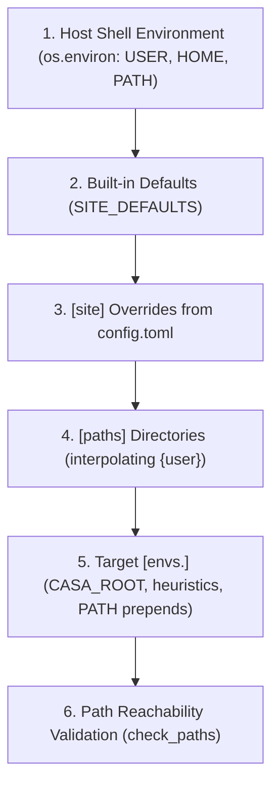

# calibpipe Documentation

`calibpipe` is a lightweight helper package for launching single-run and batch ALMA Science Pipeline jobs outside the main `pipeline` Python package. It is intended for workstation and cluster workflows where operators need a stable command-line interface, reproducible environment selection, and backward-compatible wrappers around existing `calibPipeIF.py` and `runbatch.py` usage patterns.

---

## Overview

Use `calibpipe` when you need to:

- run a single MOUS from the command line without entering an interactive CASA session
- submit many MOUS runs to Slurm from a pipefile
- resolve CASA and pipeline environment variables from TOML configuration instead of ad hoc shell scripts
- preserve compatibility with operational scripts that still call `calibPipeIF.py`, `runbatch.py`, or `calibpipe_env.sh`

`calibpipe` does not replace the main `pipeline` package. The `pipeline` repository still provides the reduction framework, heuristics, task implementations, and weblog generation. `calibpipe` is the execution-oriented wrapper that selects a configured CASA + pipeline environment and launches a run with the requested inputs.

---

## Repository Layout

The project is organized as follows:

```text
calibpipe/
├── README.md
├── docs/
│   ├── index.md
│   ├── guide.md
│   └── api.md
├── src/
│   └── calibpipe/
│       ├── cli.py
│       ├── config.py
│       ├── driver.py
│       ├── batch.py
│       ├── steps/
│       └── legacy/
└── tests/
```

Key implementation modules:

- `src/calibpipe/cli.py` provides the unified command-line interface.
- `src/calibpipe/config.py` loads TOML configuration and builds the runtime environment.
- `src/calibpipe/driver.py` orchestrates a single pipeline run.
- `src/calibpipe/batch.py` generates and submits Slurm jobs.
- `src/calibpipe/steps/` houses modular execution phases (staging, PMR, PPR, CASA runner).
- `src/calibpipe/legacy/` contains compatibility wrappers.

---

## Installation

Install from the canonical top-level `calibpipe/` checkout:

```bash
cd /path/to/calibpipe
pip install -e .
```

For an isolated user install (recommended on shared clusters):

```bash
pipx install /path/to/calibpipe
```

---

> [!WARNING]
> **Observatory Infrastructure & Cluster Dependency**
>
> `calibpipe` is an execution driver designed for ALMA Science Pipeline operations on observatory HPC clusters (e.g., NAASC cluster) and specialized pipeline workstations. Running `calibpipe` with arbitrary custom configurations on a standard personal workstation will **not work out-of-the-box** unless you have access to valid ALMA pipeline installations, Slurm, ALMA datapacker, and `pipelineMakeRequest` (PMR).
>
> If you are working on an observatory cluster, refer to your site administrator or internal templates (e.g. `notes/config.internal.example.toml`).

---

## Configuration

`calibpipe` relies on a structured TOML configuration file to separate code from site-specific paths and CASA installations. Start from `config.example.toml` in the repository root and copy it to `config.toml`.

### 1. File Discovery Precedence

When any `calibpipe` command or script runs, the configuration file is resolved in the following strict order of precedence (first found wins):

1. **CLI Argument:** `--config=<path>`
2. **Environment Variable:** `$CALIBPIPE_CONFIG`
3. **Current Working Directory:** `./config.toml`
4. **User Config Directory:** `~/.config/calibpipe/config.toml`


If none of these paths exist, `calibpipe` raises an actionable `ConfigError`.

---

### 2. Configuration Hierarchy & Structure

The TOML configuration is organized into three distinct tiers:

```
config.toml
├── default_env = "main"          <-- Default target environment
├── [paths]                       <-- Tier 1: Working directories & pipeline datasets
├── [envs.<name>]                 <-- Tier 2: Selectable CASA + Pipeline runtime targets
└── [site]                        <-- Tier 3: Observatory tooling & cluster overrides (Optional)
```

#### Tier 1: Workspace & Product Paths (`[paths]`)
Configures directories where runs, logs, and reference databases reside:
- `scipipe_rootdir`: Root directory where execution folders and data products are staged. Supports `{user}` interpolation.
- `scipipe_logdir`: Root directory for driver and subprocess execution logs. Supports `{user}` interpolation.
- `pickle_dir`: (Optional) Directory for post-run pickle logs. Supports `{user}` interpolation.
- `obscaldir`: (Optional) Path to static offline calibrator database (passed to the pipeline via `--staticobscal`).
- `aUdir`: (Optional) Directory for auxiliary `analysisUtils` scripts.
- `validation_dir`: (Optional) Directory containing baseline reference products.
- `heuristics_root`: (Optional) Base directory for multi-branch pipeline checkouts (`{heuristics_root}/{branch}`).

#### Tier 2: Runtime Targets (`[envs.<name>]`)
Each `[envs.<name>]` table represents a selectable CASA installation and pipeline version (e.g. `[envs.main]`, `[envs.dev]`, `[envs.pl2025]`):
- `casa_root`: **[Required]** Root path to the CASA installation containing `bin/casa` and `bin/mpicasa`.
- `branch`: **[Optional]** Pipeline branch identifier (defaults to `<name>`).
- `heuristics_dir`: **[Optional]** Path to pipeline heuristics checkout. Supports template substitutions `{casa_root}` and `{branch}` (e.g. `{casa_root}/pipeline`).
- *Arbitrary extra keys:* Any additional key-value pairs in this table are exported as environment variables for that specific target.

#### Tier 3: Site & Cluster Overrides (`[site]`) (Optional)
Overrides the package's built-in defaults for observatory-specific infrastructure:
- `pmr_home`: Installation root for `pipelineMakeRequest` (default: `/opt/pipetools/latest`).
- `datapacker_home`: ALMA datapacker installation root (default: `/opt/datapacker/current`).
- `acsdata`: ACS data directory (default: `/opt/acsdata`).
- `java_home`: JVM runtime path (default: `$JAVA_HOME` or `/usr/lib/jvm/default-java`).
- `flux_service_url`: Primary ALMA flux service URL.
- `flux_service_url_backup`: Secondary ALMA flux service backup URL.
- `submit_host`: If set, `calibpipe batch` strictly refuses to submit Slurm jobs unless run on this specific hostname.
- `strict_paths`: If set to `true`, path validation aborts with an error instead of issuing warnings.

---

### 3. Environment Variable Precedence & Construction

When `build_environment()` runs, environment variables are assembled and overlaid in the following order:



1. **Host Environment:** Reads baseline `os.environ` (inherits `USER`, `HOME`, base `PATH`).
2. **Site Defaults & Overrides:** Resolves `JAVA_HOME`, `ACSDATA`, `ACSROOT` (`pmr_home`), `DATAPACKER_HOME`, `JARSDIR`, `FLUX_SERVICE_URL`.
3. **Paths Resolution:** Resolves and creates `SCIPIPE_ROOTDIR`, `SCIPIPE_LOGDIR`, `PICKLE_DIR`, `OBSCALDIR`, `AUDIR`, `VALIDATION_DIR`.
4. **Environment Target Resolution:** Sets `CASA_ROOT`, prepends `CASA_ROOT/bin` and `PMR/bin` to `PATH`, and sets `SCIPIPE_HEURISTICS`.
5. **Path Validation:** `check_paths()` checks disk accessibility for `CASA_ROOT`, `pmr_home`, `datapacker_home`, `acsdata`, and `java_home`. If any path is missing, actionable guidance is printed to `sys.stderr`.

---

## Command-Line Workflows

`calibpipe` provides one CLI with three primary workflows.

### 1. Run a Single MOUS

```bash
calibpipe run --mous=uid://A001/X128a/Xb9 --env=main --recipe=calimage
```

This resolves the selected environment, stages the run inputs, and launches the underlying pipeline execution.

The legacy wrapper still works:

```bash
./calibPipeIF.py --mous=uid://A001/X128a/Xb9 --env=main
```

### 2. Submit a Batch to Slurm

```bash
calibpipe batch quick.run --env=main -c 8 -m 248 -p plwg
```

The `quick.run` file contains one MOUS per line, with an optional recipe column:

```text
# <mous_uid> [recipe]
uid://A001/X128a/Xb9 calimage
uid://A002/Xcff05c/Xd calimage
```

The legacy wrapper also remains available:

```bash
./runbatch.py quick.run --env=main -c 8 -m 248 -p plwg
```

### 3. Resolve a Shell Environment

```bash
eval "$(calibpipe env --env=main)"
```

This prints shell exports that can be evaluated directly in `bash` or `zsh`.

The compatibility wrapper is:

```bash
source calibpipe_env.sh --env=main
```

Use `calibpipe_env.sh` when you want the resolved CASA and pipeline variables loaded into your current shell session and prefer the older `source ...` workflow. It must be sourced rather than executed, and it exists mainly as a compatibility wrapper around `calibpipe env`.

---

## Backward Compatibility

`calibpipe` preserves legacy entry points so existing user scripts do not need to change immediately.

- `calibPipeIF.py` forwards to `calibpipe run`
- `runbatch.py` forwards to `calibpipe batch`
- `calibpipe_env.sh` forwards to `calibpipe env`

This allows gradual migration to the unified CLI without breaking older job wrappers.

---

## Testing

Run the test suite from the project root:

```bash
pytest tests/
```

The suite covers configuration loading, driver behavior, and batch submission logic. Golden reference files under `tests/reference/` verify generated call sequences and `sbatch` command content.

---

## Building the Documentation

Install the documentation extras and build or serve the documentation locally:

```bash
# Live reloading server
uv run --extra docs zensical serve

# Or static HTML build
uv run --extra docs zensical build
```

The Zensical configuration lives in `zensical.toml`. API pages are generated through `mkdocstrings-python` by importing modules from `src/`.

---

## Related Files

- `README.md` (repository root): top-level package overview and quick start
- `config.example.toml`: example configuration template
- `quick.run`: sample batch input format
- [API Reference](api/index.md): generated API reference
