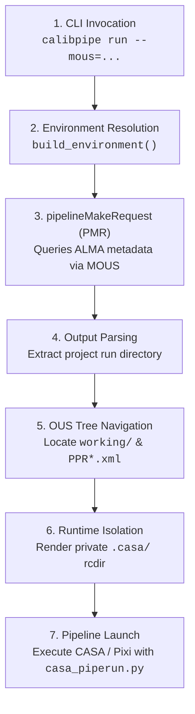

# Execution Lifecycle & Staging Internals

This document explains the internal mechanisms `calibpipe` uses to resolve project identifiers, stage pipeline inputs via `pipelineMakeRequest` (PMR), navigate the Observing Unit Set (OUS) filesystem hierarchy, and isolate CASA runtime state.

---

## High-Level Execution Lifecycle

When you execute a reduction with `calibpipe run --mous=uid://A001/X128a/Xb9 --env=main`, the driver orchestrates the following execution sequence:



---

## 1. How the Project Identifier is Determined

Users only provide the Member Observing Unit Set identifier on the command line:

```bash
calibpipe run --mous=uid://A001/X128a/Xb9 --env=main
```

`calibpipe` does not parse or guess the ALMA project code itself. Instead, it delegates project metadata resolution directly to the ALMA Science Pipeline operational tool **`pipelineMakeRequest` (PMR)**.

### Invocation of `pipelineMakeRequest`

In `src/calibpipe/driver.py`:

```python
pmr_cmd = f"pipelineMakeRequest {asdms_arg}{mous_uid} {intents_xml} {procedure} {dl_asdms} {dl_cal}"
cmdoutput = getoutput(pmr_cmd)
```

The arguments passed to PMR are:
- `asdms_arg`: Optional list of specific Execution Blocks (`--asdms [...]` when `--onlysemipass` is used).
- `mous_uid`: The target MOUS identifier (e.g. `uid://A001/X128a/Xb9`).
- `intents_xml`: Selection of pipeline intents (`intents_hsd.xml` for single-dish; `intents_hifa.xml` for interferometry).
- `procedure`: The pipeline procedure XML file derived from the recipe (e.g. `procedure_hifa_calimage.xml`).
- `dl_asdms`: Boolean flag indicating whether PMR should download ASDM raw data (`true` or `false`).
- `dl_cal`: Boolean flag indicating whether PMR should fetch calibrator tables (`true` for image recipes without `--flag`).

### Metadata Resolution Inside PMR

When `pipelineMakeRequest` executes:
1. It contacts the ALMA archive / metadata services using the MOUS UID.
2. It resolves the project code (e.g. `2016.2.00105.S`), the science goal, and the OUS tree structure.
3. It combines the project code with the current execution timestamp to form a unique project run directory:
   $$\text{ppmr\_rel\_dir} = \text{<ProjectCode>}\_\text{<ISO\_Timestamp>}$$
   *(e.g. `2016.2.00105.S_2026_10_01T07_10_51.324`)*.
4. It creates the project directory inside `SCIPIPE_ROOTDIR` and generates the OUS directory tree underneath it.

---

## 2. Parsing the Project Root Directory

During its execution, `pipelineMakeRequest` writes diagnostic banners to `stdout`. One of these banners explicitly identifies the newly created run root directory:

```text
Running pipelineMakeRequest...
Project root directory is 2016.2.00105.S_2026_10_01T07_10_51.324
no files missing
```

In `src/calibpipe/driver.py`, `calibpipe` scans the output line-by-line:

```python
ppmr_rel_dir = ""
piperootdir = env.get("SCIPIPE_ROOTDIR", "")
for line in cmdoutput.split("\n"):
    if "Project root directory is" in line:
        ppmr_rel_dir = line.split()[-1]
        break

ppmr_dir = f"{piperootdir}/{ppmr_rel_dir}" if ppmr_rel_dir else piperootdir
```

- `line.split()[-1]` extracts the relative directory: `2016.2.00105.S_2026_10_01T07_10_51.324`.
- It prepends `SCIPIPE_ROOTDIR` (configured in `[paths].scipipe_rootdir`, e.g. `/data/pipeline/root/{user}`), producing the absolute project run path:
  `/data/pipeline/root/user/2016.2.00105.S_2026_10_01T07_10_51.324`.

> [!WARNING] Failure Detection
> If `pipelineMakeRequest` fails (due to archive connection issues, missing credentials, or invalid MOUS UIDs), no line matching `"Project root directory is"` will be printed. In this case, `calibpipe` halts immediately with an explicit error, logging the complete PMR output:
> ```text
> ERROR: pipelineMakeRequest failed (could not determine project root directory):
> <cmdoutput>
> ```

---

## 3. Staged Filesystem Structure & Symlink Shortcuts

Inside `ppmr_dir`, `pipelineMakeRequest` lays out the standard ALMA Science Pipeline directory hierarchy. To avoid requiring users and operators to navigate deeply nested paths (such as `SOUS_uid___.../GOUS_uid___.../MOUS_uid___.../working/`), `calibpipe` automatically generates **relative convenience symlinks** directly in the project run root:

```text
<scipipe_rootdir>/
└── 2016.2.00105.S_2026_10_01T07_10_51.324/        <-- Project run root
    ├── working   -> SOUS_.../GOUS_.../MOUS_.../working   <-- Convenience shortcut
    ├── products  -> SOUS_.../GOUS_.../MOUS_.../products  <-- Convenience shortcut
    ├── rawdata   -> SOUS_.../GOUS_.../MOUS_.../rawdata   <-- Convenience shortcut
    ├── calibPipeIF.2016.2.00105.S_....log          <-- calibpipe driver log
    └── SOUS_uid___A001_X128a_Xb7/                   <-- Science OUS
        └── GOUS_uid___A001_X128a_Xb8/               <-- Group OUS
            └── MOUS_uid___A001_X128a_Xb9/           <-- Member OUS
                ├── rawdata/                         <-- Downloaded ASDMs (*.asdm.sdm)
                ├── products/                        <-- Calibration tables & final products
                └── working/                         <-- Active execution directory
                    ├── PPR_uid___A001_X128a_Xb9.xml <-- Pipeline Processing Request
                    ├── casa_piperun.py              <-- Generated CASA execution script
                    └── .casa/                       <-- Isolated CASA runtime state
                        ├── config.py
                        └── startup.py
```

### Why Symlink Shortcuts are Used Instead of Physical Restructuring
1. **Instant Inspection:** You can immediately inspect intermediate state or results without typing the lengthy UID path:
   ```bash
   cd <scipipe_rootdir>/2016.2.00105.S_2026_10_01T07_10_51.324/working
   ls <scipipe_rootdir>/2016.2.00105.S_2026_10_01T07_10_51.324/products
   ```
2. **PPR XML Safety:** The pipeline process executes within the canonical physical directory `.../MOUS_.../working/`, keeping `<RelativePath>` inside `PPR.xml` 100% valid.
3. **Archival & Datapacker Compatibility:** Downstream packaging tools (e.g. `datapacker`) and ingestion scripts strictly expect the 3-tier `SOUS_.../GOUS_.../MOUS_...` hierarchy. Symlinks keep the canonical hierarchy intact.
4. **Configuration & CLI Control:** Controlled by `[run].symlink_shortcuts = true` in `config.toml` (or via `--symlink-shortcuts` / `--no-symlink-shortcuts` on the CLI).

### Directory Roles

| Directory | Created By | Purpose |
| :--- | :--- | :--- |
| `rawdata/` | PMR | Raw ALMA Science Data Model (`.asdm.sdm`) execution blocks. |
| `working/` | PMR / `calibpipe` | Where CASA runs. Contains the PPR XML, Casa pipescript, and intermediate MS files. |
| `products/` | ALMA Pipeline | Final calibrated tables, FITS images, and pipeline weblogs. |
| `working/.casa/`| `calibpipe` | Private CASA runtime environment isolating user config and telemetry. |

---

## 4. OUS Directory Navigation & PPR Resolution

Once `ppmr_dir` is identified, `calibpipe` locates the `working/` directory using standard shell globbing:

```python
dir_working_output = getoutput(
    f"ls -d1 {ppmr_dir}/SOUS_uid___*/GOUS_uid___*/MOUS_uid___*/working/"
)
if "No such file" in dir_working_output or "cannot access" in dir_working_output:
    dir_working_output = getoutput(f"ls -d1 {ppmr_dir}/MOUS_uid___*/working/")
```

1. **Standard 3-Tier Hierarchy:** Checks for `SOUS_uid___*/GOUS_uid___*/MOUS_uid___*/working/`.
2. **Flat Hierarchy Fallback:** If the SOUS/GOUS wrapper folders are omitted, falls back to `{ppmr_dir}/MOUS_uid___*/working/`.
3. **PPR XML Location:** Searches for the Pipeline Processing Request XML file:
   ```python
   working_path = Path(ppmr_fulldir.replace("//", "/")) / "working"
   ppr_matches = list(working_path.glob("PPR*.xml"))
   ```
   If a matching `PPR*.xml` is found, `calibpipe` records its path; otherwise, it falls back to `{ppmr_fulldir}/working/PPR.xml`.

---

## 5. Frequently Asked Questions (FAQ)

### Q: Why does `calibpipe` only ask for `--mous` and not `--project`?
**A:** In the ALMA data model, every MOUS UID (e.g. `uid://A001/X128a/Xb9`) is globally unique and directly indexed in the ALMA archive. `pipelineMakeRequest` uses the MOUS to resolve the project code, PI name, cycle, and observing parameters automatically, eliminating human error from entering conflicting project IDs.

### Q: Why is a timestamp appended to the project folder?
**A:** On shared clusters, multiple runs or re-reductions of the same project (or even the same MOUS with different parameters) may occur over time. Appending an ISO timestamp (e.g. `_2026_10_01T07_10_51.324`) ensures:
- Runs never clobber existing data products or intermediate tables from previous attempts.
- Multiple batch jobs running concurrently never experience race conditions on the top-level project folder.

### Q: What should I check if PMR fails with `could not determine project root directory`?
**A:** This indicates `pipelineMakeRequest` did not emit the expected `Project root directory is ...` banner. Common causes:
1. **Unreachable PMR installation:** Verify `[site].pmr_home` in `config.toml` (defaults to `/opt/pipetools/latest`).
2. **Missing Archive connectivity:** PMR requires network access to the ALMA archive metadata service. Check proxy settings or observatory VPN/firewalls.
3. **Missing Java runtime:** PMR requires Java. Check `[site].java_home` or verify that `java -version` works in your shell.
4. **Invalid MOUS UID:** Confirm the MOUS UID exists in the archive and is properly formatted (`uid://A001/...` or `uid___A001_...`).

### Q: How does CASA know to execute inside `working/`?
**A:** Before invoking CASA (or `pixi run`), `calibpipe`:
1. Changes the process working directory directly to `ppmr_fulldir/working/` (`os.chdir(...)`).
2. Generates an execution script (`casa_piperun.py`) in that directory.
3. Launches CASA with `-c /absolute/path/to/working/casa_piperun.py`.
4. Passes `--cachedir`, `--configfile`, and `--startupfile` pointing into `working/.casa/` to isolate user state.
